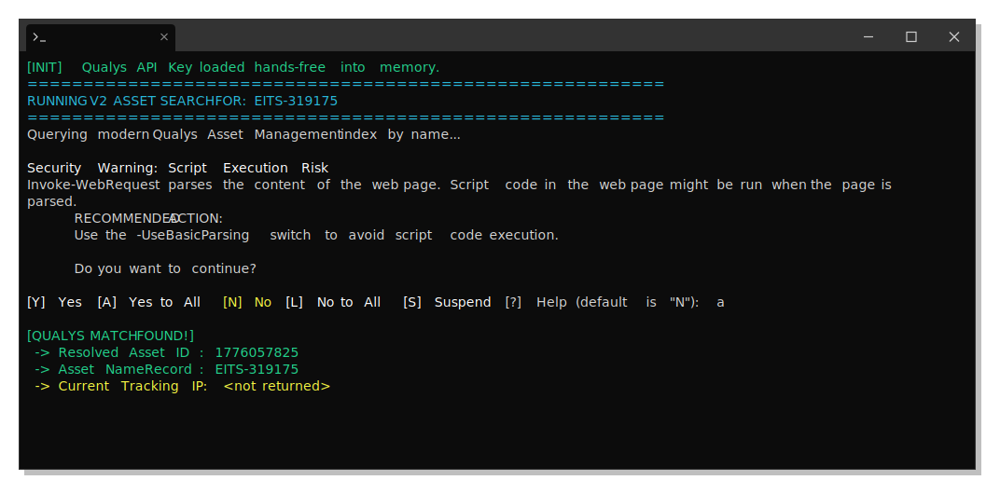
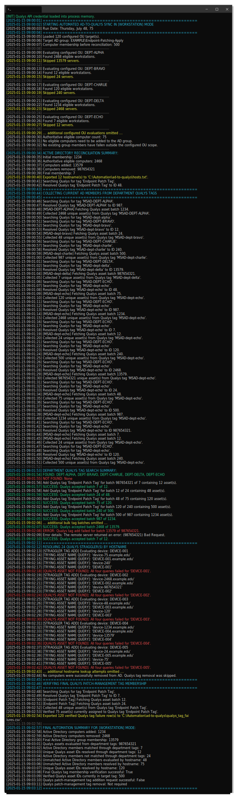

# Automated AD-to-Qualys Patch Management Onboarding

> **Author:** Gabriel Wolf

Enterprise security automation for synchronizing Active Directory computer inventories with Qualys Patch Management.

The workflow discovers eligible workstation and server assets from designated Active Directory organizational units, synchronizes them with managed Active Directory security groups, resolves the corresponding Qualys Host Asset records, and applies the appropriate patch-management tags. Systems that leave the configured OU scope are removed from both the Active Directory group and the Qualys patch-management scope.

> [!NOTE]
> This automation was developed for and is actively used in a large-scale enterprise environment. The public repository contains sanitized configuration values and excludes production credentials, internal infrastructure details, and organization-specific identifiers.

---

## Overview

A computer may exist in Active Directory and have the Qualys Cloud Agent installed without being included in the correct patch-management scope.

This project connects Active Directory and Qualys so that patch-management membership can be maintained from an authoritative OU configuration rather than through manual asset tagging.


The automation supports both workstation and server workflows while keeping their Active Directory groups, Qualys tags, OU lists, and operating-system filters separate.

---

## Workflow

### 1. Secure credential initialization

`Initialize-QualysPassword.ps1` prompts for the Qualys API credential as a PowerShell `SecureString` and stores an encrypted representation at the configured secret path:

```text
C:\ProgramData\QualysAutomation\qualys_password.enc
```

On Windows, `ConvertFrom-SecureString` without a custom key uses Windows Data Protection API protection associated with the current Windows user context. The initialization script must therefore be run under the same Windows account that will execute the automation.

The saved credential is decrypted into process memory only when required for Qualys API authentication. It is not hardcoded in the scripts or stored in plaintext configuration.

### 2. Active Directory reconciliation

`Automation.ps1` runs in either `Workstation` or `Server` mode and:

1. Reads the corresponding OU configuration file.
2. Recursively discovers computer objects in the configured OUs.
3. Filters systems by operating-system type.
4. Builds the authoritative membership set for the selected patch-management scope.
5. Adds missing computers to the managed Active Directory group.
6. Removes group members that are no longer in the configured OU scope.
7. Enables a removal safety lock when any configured OU cannot be resolved or queried.
8. Exports the reconciled group membership to `hosts.txt`.

### 3. Department-based Qualys resolution

For each configured department, the automation searches for both capitalization variants of the corresponding dynamic tag:

```text
AD - DEPARTMENT
AD - department
```

It retrieves all paginated Qualys Host Asset records assigned to the matching department tag, normalizes each returned hostname, and accepts only assets whose hostname appears in the final Active Directory group.

### 4. Hostname fallback resolution

Any final Active Directory group member not matched through a department tag is resolved through the Qualys Host Asset API using four hostname variants:

```text
hostname.example.com
HOSTNAME.example.com
hostname
HOSTNAME
```

Returned Host Asset IDs are deduplicated before any tag update is submitted.

### 5. Patch-management tag updates

The automation:

- Applies the workstation or server patch-management tag in smaller batches.
- Resolves computers successfully removed from Active Directory and removes the patch-management tag from their Qualys assets.
- Excludes any asset from removal when it is still present in the current authoritative target set.

### 6. Final verification and failure reporting

After tag updates complete, the automation re-queries the target Qualys patch-management tag and verifies actual final membership.

Devices that cannot be resolved or whose resolved Host Asset IDs are not fully present in the final target tag are written to:

```text
qualys_tag_failures.csv
```

This verification prevents an accepted API response from being treated as proof that every requested asset was successfully tagged.

---

## Successful Execution Examples

> [!NOTE]
> Your output will depend on what parameters you have set in the code. These examples have been sanitized. 



     



---

## Project Files

### [`Automation.ps1`](Automation.ps1)

The main production automation script.

```powershell
.\Automation.ps1 -TargetMode Workstation
```

```powershell
.\Automation.ps1 -TargetMode Server
```

It performs Active Directory reconciliation, department-tag discovery, hostname fallback resolution, batched Qualys tag updates, final membership verification, failure reporting, and operational logging.

### [`Initialize-QualysPassword.ps1`](Initialize-QualysPassword.ps1)

Creates the encrypted Qualys credential used by the automation and diagnostic scripts.

The script must be run under the same Windows account that will execute the scheduled automation unless the encrypted credential is regenerated under a new execution identity.

The credential is entered as a PowerShell `SecureString` and stored using Windows DPAPI protection associated with the current user context.

This prevents the credential from being:

- Hardcoded in PowerShell scripts
- Stored in plaintext configuration
- Committed to source control
- Exposed through ordinary repository access

The encrypted file and its containing directory should be restricted through appropriate filesystem permissions.


### [`Get-QualysAsset.ps1`](Get-QualysAsset.ps1)

A diagnostic utility for validating Qualys API connectivity and resolving an individual asset by hostname.


The script:

- Loads the encrypted Qualys credential
- Submits an XML Host Asset search request
- Searches for an exact hostname match
- Displays the returned Host Asset ID
- Displays the asset name
- Displays the current tracking IP when available


### [`Schedule-Task.ps1`](Schedule-Task.ps1)

Registers the workstation and server automation runs in Windows Task Scheduler.

The script:

- Stores environment-specific paths, schedules, and execution modes in a configurable variable block
- Creates PowerShell task actions with an explicit execution-policy bypass
- Creates daily triggers
- Requires an active network connection before execution
- Prompts for the service-account credential
- Registers tasks with elevated privileges
- Runs the tasks in the background whether or not the service account is signed in interactively

The scheduled-task service account may need to be granted the Log on as a batch job user right on the execution host and must not be included in Deny log on as a batch job.

---

## Required Configuration Files

The OU configuration files must be stored in the same directory as `Automation.ps1`.

### `<list-of-workstation-ous.txt>`

Contains the department or top-level OU names evaluated in workstation mode.

```text
IT
FINANCE
HR
```

### `<list-of-server-ous.txt>`

Contains the department or top-level OU names evaluated in server mode.

```text
APPLICATIONS
INFRASTRUCTURE
DATABASES
```

Each non-empty line represents one OU name. Blank lines are ignored.

The configured names must align with both:

- OUs located beneath the configured Active Directory search base
- Qualys department dynamic tags using the `AD - <department>` naming convention

---

## Generated Files

### `hosts.txt`

Contains the final computer names from the reconciled Active Directory group.

The file is overwritten during each run.

### `sync_log.txt`

Contains timestamped operational logs for:

- Selected execution mode
- OU discovery and validation
- Active Directory membership changes
- Removal safety-lock activation
- Department-tag searches and pagination
- Hostname fallback queries
- Batched Qualys tag updates
- Final tag-membership verification
- Execution summaries and errors

The file is appended to preserve a historical execution trail.

### `qualys_tag_failures.csv`

Contains devices that were not fully verified in the configured Qualys patch-management tag.

The CSV includes:

- Device hostname
- Associated department
- Resolved Qualys Host Asset IDs
- Failure status
- Failure description

Possible failures include:

- No matching Qualys Host Asset record
- Qualys API lookup errors
- Failed tag-update batches
- Resolved Host Asset IDs missing from the final verified target tag

Fully verified devices are excluded. The file is overwritten during each run.

### `<secret-directory>/<secret-file-name.enc>`

Contains the encrypted Qualys credential created by `Initialize-QualysPassword.ps1`.

This file must not be committed to the repository.

---

## Repository Structure

```text
.
├── Automation.ps1
├── Get-QualysAsset.ps1
├── Initialize-QualysPassword.ps1
├── Schedule-Task.ps1
├── <list-of-workstation-ous.txt>
├── <list-of-server-ous.txt>
├── README.md
└── imgs
```

Files generated during execution:

```text
hosts.txt
sync_log.txt
qualys_tag_failures.csv
```

---

## Requirements

### PowerShell and Windows

- Windows PowerShell 5.1 or a compatible PowerShell environment
- Windows host joined to or able to query the target Active Directory domain
- Active Directory PowerShell module
- TLS 1.2 connectivity to the Qualys API

Verify the Active Directory module with:

```powershell
Get-Module -ListAvailable ActiveDirectory
```

### Active Directory permissions

The execution account requires permission to:

- Read the configured organizational units
- Read computer objects and operating-system attributes
- Read the managed Active Directory groups
- Enumerate group membership
- Add computer objects to the managed groups
- Remove computer objects from the managed groups

Unrestricted domain-administrator access is not required. Delegate only the permissions needed for the designated OUs and groups.

### Qualys permissions

The Qualys API account requires permission to:

- Search Host Asset records
- Search and read tags
- Read paginated assets associated with tags
- Update Host Asset tag assignments

Use the least-privileged Qualys role that supports these operations.

### Network access

The execution host must be able to reach:

- Active Directory domain controllers
- Required DNS services
- The configured Qualys API platform over HTTPS

---

## Initial Setup

### 1. Configure the environment

Update the environment-specific values in `Automation.ps1`:

```powershell
$QualysUsername = "<your-api-username>"
$QualysPlatform = "<qualysapi.qualys.com>"
$SecretPath     = "<path-to-secret-enc>"

$DnsSuffix        = "<example.com>"
$OUMenuSearchBase = "<DC=example,DC=com>"

$WorkstationADGroupDN = "<workstation-group-distinguished-name>"
$ServerADGroupDN      = "<server-group-distinguished-name>"

$WorkstationQualysTag = "<workstation-patch-management-tag>"
$ServerQualysTag      = "<server-patch-management-tag>"

$WorkstationOUFileName = "<list-of-workstation-ous.txt>"
$ServerOUFileName      = "<list-of-server-ous.txt>"
```

Public repository values should remain sanitized and must not identify production service accounts, domains, hosts, groups, or directory structures.

### 2. Create the OU configuration files

Create the workstation and server OU lists using the department names expected by both Active Directory and the Qualys department tags.

Blank lines are ignored.

### 3. Create the Qualys department dynamic tags

The `AD - <department>` convention is specific to this workflow and is not created automatically by Qualys.

Create one dynamic tag for every department listed in either OU configuration file.

```text
Tag name: AD - <department>
Tag type: Dynamic
Dynamic tag source: Asset Inventory
Query: customAttributes:(value:'OU=<DEPARTMENT>,DC=<CONTOSO>,DC=<COM>')
```

Example:

```text
Tag name: AD - finance
Query: customAttributes:(value:'OU=FINANCE,DC=CONTOSO,DC=COM')
```

The automation checks both uppercase and lowercase department variants, but only one consistent naming form needs to exist.

### 4. Initialize the Qualys credential

Run the credential initialization script under the same account that will execute the automation:

```powershell
.\Initialize-QualysPassword.ps1
```

Confirm that the encrypted credential file was created at the configured secret path.

### 5. Test an individual Qualys asset

Set the test hostname inside `Get-QualysAsset.ps1` and run:

```powershell
.\Get-QualysAsset.ps1
```

Confirm that the expected Host Asset ID and hostname are returned.

### 6. Test workstation mode

```powershell
.\Automation.ps1 -TargetMode Workstation
```

Review:

```text
sync_log.txt
hosts.txt
qualys_tag_failures.csv
```

Confirm that the correct Active Directory group, OU file, and Qualys patch-management tag were selected.

### 7. Test server mode

```powershell
.\Automation.ps1 -TargetMode Server
```

Repeat the same validation for the server profile.

---

## Scheduled Execution

Use [`Schedule-Task.ps1`](Schedule-Task.ps1) to register the automation under a dedicated service account.

The scheduled-task account must be the same account that ran `Initialize-QualysPassword.ps1`. Regenerate the encrypted credential whenever the execution account, host, Windows profile, or Qualys credential changes.

---

## Design and Safety

### Authoritative OU scope

The configured OU list defines which computers should belong to each patch-management scope.

During each run:

- Eligible computers missing from the managed Active Directory group are added.
- Existing group members outside the configured OU scope are removed.
- Computers successfully removed from Active Directory are processed for Qualys tag removal.

This keeps the Active Directory group synchronized with the intended workstation or server scope.

### Removal safety lock

If any configured OU cannot be resolved or queried, the script disables all removal operations for that run.

It may continue processing valid additions, but it does not:

- Remove computers from the Active Directory group
- Remove the Qualys patch-management tag from former members

This reduces the risk of accidental mass removal caused by an incomplete authoritative scope.

### Department-first resolution

Department dynamic tags provide the primary Qualys lookup method. Hostname queries are used only for final Active Directory group members that were not matched through those tags.

This reduces the number of individual API searches required for large inventories.

### Batched updates

Host Asset IDs are submitted in smaller batches rather than one request per asset or one oversized inventory-wide request.

Each batch is logged independently.

### Final membership verification

A successful API response confirms that Qualys accepted a request, but it does not independently prove that every requested asset now has the target tag.

The workflow therefore re-queries the target patch-management tag after all updates and compares actual membership against the resolved Host Asset IDs.

### Removal scope

The script removes the Qualys patch-management tag only from computers successfully removed from the managed Active Directory group during the current run.

It does not independently purge every unexpected asset already present in the Qualys tag.

---

## Security Considerations

- Do not hardcode credentials.
- Do not commit encrypted credential files.
- Run the workflow under a dedicated service account.
- Delegate only the required Active Directory permissions.
- Limit the Qualys account to required Host Asset search, tag-read, and tag-update operations.
- Restrict filesystem access to the scripts, credential file, logs, and generated reports.
- Protect scheduled-task definitions and service-account credentials.
- Rotate the Qualys credential according to organizational policy.
- Regenerate the encrypted credential after changing the execution account, host, Windows profile, or Qualys credential.
- Treat the managed Active Directory groups as automation-controlled.
- Keep OU configuration names aligned with the corresponding `AD - <department>` dynamic tags.
- Validate dynamic-tag queries and removal behavior in a controlled environment before scheduled production use.
- Treat logs, hostname exports, asset IDs, and failure reports as internal operational data.

---

## Recommended `.gitignore`

```gitignore
# Generated operational data
hosts.txt
sync_log.txt
qualys_tag_failures.csv
*.log

# Credentials and encrypted secret material
*.enc
qualys_password.enc

# Local test files
*.local.ps1
test-output/
```

---

## Error Handling

The automation stops, skips processing, or enables the removal safety lock when required to protect the managed scope.

- Missing encrypted credential
- Credential decryption failure
- Missing or empty OU configuration file
- Missing Active Directory group
- Failed group-membership enumeration
- Unresolvable or ambiguous OU name
- Failed OU computer enumeration
- Failed Active Directory group addition or removal
- Qualys API communication failure
- Missing target Qualys patch-management tag
- Missing department-tag capitalization variants
- Failed Host Asset pagination
- Missing pagination metadata
- Unmatched hostname
- Failed Qualys tag-update batch
- Failed final tag-membership verification
- An asset scheduled for removal also appearing in the current target set


Errors and warnings are written to both the console and `sync_log.txt`.

---

## Disclaimer

This repository demonstrates an enterprise security automation pattern.

Names, credentials, paths, domains, organizational units, groups, tags, and other environment-specific values shown in the public version are placeholders or sanitized examples. Review, test, and adapt the scripts to the security requirements of the target environment before use.
