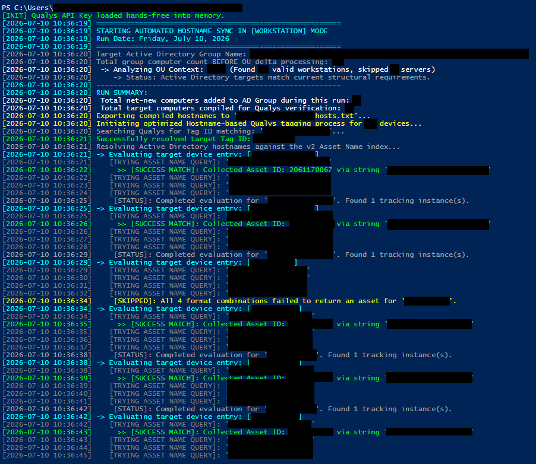

# Automated AD-to-Qualys Patch Management Onboarding

Enterprise security automation for synchronizing Active Directory computer inventories with Qualys Patch Management.

This project discovers eligible workstation and server assets from designated Active Directory organizational units, adds missing computers to the appropriate security groups, resolves the corresponding assets in Qualys, and applies the Qualys tags used to place those systems into the correct patch-management scope.

> [!NOTE]
> This automation was developed for and is actively used in a large-scale enterprise environment. The public repository contains sanitized configuration values and does not include production credentials, internal infrastructure details, or organization-specific identifiers.

---

## Overview

Enterprise patch-management platforms depend on accurate asset scope.

A computer may exist in Active Directory and have the Qualys Cloud Agent installed, but it will not necessarily receive the intended patch jobs unless it is assigned to the correct Qualys tag or asset group.

This automation connects the two systems:


The result is a repeatable onboarding process that reduces manual asset handling and helps ensure newly deployed systems are brought under enterprise patch-management controls.

---

## Patch-Management Workflow

The automation performs the following operations:

1. Runs in either `Workstation` or `Server` mode.
2. Reads a list of Active Directory organizational units from the corresponding configuration file.
3. Searches those OUs recursively for computer objects.
4. Uses the computer operating-system value to separate workstations from servers.
5. Compares eligible computers against the appropriate Active Directory security group.
6. Adds computers that are not already members of that group.
7. Compiles the final group membership into a list of hostnames.
8. Resolves each hostname against the Qualys Asset Management API.
9. Accounts for common hostname variations, including:
   * Lowercase short hostname
   * Uppercase short hostname
   * Lowercase fully qualified domain name
   * Uppercase fully qualified domain name
10. Collects unique Qualys asset IDs.
11. Resolves the configured Qualys tag by name.
12. Applies the tag to all matched assets through a bulk API request.
13. Writes execution details and summary statistics to a local log.

Qualys patch jobs can then target the assigned workstation or server tag, allowing newly discovered assets to enter the appropriate patch-management workflow without requiring an engineer to manually locate and tag each device.

---

## Project Files

### `Automation.ps1`

The main production automation script.

It supports two execution modes:

```powershell
.\Automation.ps1 -TargetMode Workstation
```

```powershell
.\Automation.ps1 -TargetMode Server
```

The script:

* Loads the encrypted Qualys credential
* Reads the appropriate OU configuration file
* Discovers computers in Active Directory
* Filters computers by operating-system type
* Adds missing computers to the appropriate AD group
* Exports the resulting hostnames
* Resolves the configured Qualys tag
* Searches Qualys for each asset
* Deduplicates Qualys asset IDs
* Applies the patch-management tag in bulk
* Records activity and execution statistics in `sync_log.txt`

---

### `Get-QualysAsset.ps1`

A diagnostic and validation utility used to search for an individual asset in Qualys by hostname.

The script:

* Loads the encrypted Qualys credential
* Submits an XML asset search request to the Qualys Asset Management API
* Searches for an exact asset-name match
* Extracts the returned asset ID
* Displays the asset name
* Displays the current tracking IP when available

This utility is useful when validating API connectivity, troubleshooting hostname mismatches, or confirming that a device is present in the Qualys asset inventory before running the full automation.

---

### `Initialize-QualysPassword.ps1`

Initializes the encrypted Qualys API credential used by the other scripts.

The script prompts for the Qualys password or API credential as a PowerShell `SecureString` and stores an encrypted representation at:

```text
C:\ProgramData\QualysAutomation\qualys_password.enc
```

When `ConvertFrom-SecureString` is used without a custom encryption key on Windows, PowerShell uses Windows Data Protection API protection associated with the current Windows user context.

The initialization script must therefore be run under the same Windows account that will execute the scheduled automation.

This approach prevents the Qualys credential from being:

* Hardcoded in the PowerShell scripts
* Stored in a plaintext configuration file
* Committed to source control
* Exposed through ordinary repository access

The credential is decrypted into process memory when required for API authentication. It should therefore be protected through appropriate service-account security, host hardening, filesystem permissions, and least-privilege access.

---

## Required Configuration Files

The automation expects additional text files in the same directory as `Automation.ps1`.

### `<list-of-workstation-ous.txt>`

Contains the names of Active Directory organizational units that should be evaluated when the script runs in workstation mode.

Example:

```text
Finance Workstations
Engineering Workstations
Administrative Workstations
```

Each non-empty line represents one OU name.

The script searches for these OUs beneath the configured Active Directory search base and recursively evaluates the computer objects inside them.

---

### `<list-of-server-ous.txt>`

Contains the names of Active Directory organizational units that should be evaluated when the script runs in server mode.

Example:

```text
Application Servers
Infrastructure Servers
Database Servers
```

Each non-empty line represents one OU name.

---

## Generated Files

The following files are created or updated automatically during execution.

### `hosts.txt`

Contains the final list of computer names compiled from the selected Active Directory group.

This file provides a simple record of the hostnames included in the Qualys resolution phase.

It is overwritten during each run.

---

### `sync_log.txt`

Contains timestamped operational logs, including:

* Selected execution mode
* Active Directory group membership counts
* OU discovery results
* Computers added to the AD group
* Active Directory errors
* Qualys hostname search attempts
* Successful Qualys asset matches
* Unmatched devices
* Bulk tag-assignment results
* Final execution statistics

This file is appended to rather than overwritten, providing a historical execution trail.

---

### `<secret-directory>/<secret-file-name.enc>`

Generated by `Initialize-QualysPassword.ps1`.

This file must not be committed to the repository.

Add it to `.gitignore` if the credential path is ever changed to a location inside the project directory.

---

## Repository Structure

```text
.
├── Automation.ps1
├── Get-QualysAsset.ps1
├── Initialize-QualysPassword.ps1
├── <list-of-workstation-ous.txt>
├── <list-of-server-ous.txt>
├── README.md
└── imgs
```

The following files may appear after execution:

```text
hosts.txt
sync_log.txt
```

---

## Successful Execution Examples

### Qualys Asset Lookup

The following example shows `Get-QualysAsset.ps1` successfully resolving a hostname to a Qualys asset record.


### Automated AD-to-Qualys Synchronization

The following example shows `Automation.ps1` successfully processing Active Directory targets, resolving Qualys assets, and applying the configured patch-management tag.



---

## Requirements

### PowerShell and Windows

* Windows PowerShell 5.1 or a compatible PowerShell environment
* Windows host joined to or able to query the target Active Directory domain
* Active Directory PowerShell module
* TLS 1.2 connectivity to the Qualys API

The Active Directory module can be verified with:

```powershell
Get-Module -ListAvailable ActiveDirectory
```

---

### Active Directory Permissions

The execution account requires permission to:

* Read the configured organizational units
* Read computer objects and operating-system attributes
* Read the target Active Directory groups
* Enumerate group membership
* Add computer objects to the target groups

The account does not need unrestricted domain-administrator access.

Only the permissions required for the designated OUs and groups should be delegated.

---

### Qualys Permissions

The Qualys account requires sufficient API permissions to:

* Search Asset Management records
* Search tags
* Update host-asset tag assignments

The exact Qualys role and API permissions should be limited to the functions required by this automation.

---

### Network Access

The execution host must be able to reach:

* Active Directory domain controllers
* DNS services required for the environment
* The configured Qualys API platform over HTTPS

---

## Initial Setup

### 1. Configure the environment variables

Update the configuration values in `Automation.ps1`:

```powershell
$QualysUsername = "<your-api-username>"
$QualysPlatform = "<qualysapi.qualys.com>"
$SecretPath     = "<path-to-secret-enc>"

$DnsSuffix       = "<foo.bar>"
$OUMenuSearchBase = "<DC=foo,DC=bar>"

$WorkstationADGroupDN = "<CN=workstations-group-name,OU=xyz,OU=abc,DC=foo,DC=bar>"
$ServerADGroupDN      = "<CN=servers-group-name,OU=xyz,OU=abc,DC=foo,DC=bar>"

$WorkstationQualysTag = "<qualys-workstations-tag-group>"
$ServerQualysTag      = "<qualys-servers-tag-group>"

$WorkstationOUFileName = "<list-of-workstation-ous.txt>"
$ServerOUFileName      = "<list-of-server-ous.txt>"
```

The values in this public repository should remain sanitized and should not identify production domains, service accounts, computer names, or internal directory structures.

---

### 2. Create the OU configuration files

Populate `<list-of-workstation-ous.txt>` and `<list-of-server-ous.txt>` with the OU names that should be evaluated.

Blank lines are ignored.

---

### 3. Initialize the Qualys credential

Run the initialization script under the same account that will execute the automation:

```powershell
.\Initialize-QualysPassword.ps1
```

Enter the Qualys API credential when prompted.

Confirm that the encrypted file was created at the configured secret path.

---

### 4. Test a single Qualys asset

Set the test hostname inside `Get-QualysAsset.ps1`, and then run:

```powershell
.\Get-QualysAsset.ps1
```

Confirm that the expected asset ID and hostname are returned.

---

### 5. Test workstation mode

```powershell
.\Automation.ps1 -TargetMode Workstation
```

Review:

```text
sync_log.txt
hosts.txt
```

Confirm that the correct Active Directory group and Qualys tag were selected.

---

### 6. Test server mode

```powershell
.\Automation.ps1 -TargetMode Server
```

Again, confirm that the correct group, tag, and OU configuration file were selected.

---

## Scheduled Execution

The script can be run through Windows Task Scheduler under a dedicated service account.

A typical scheduled-task configuration includes:

* **Program:** `powershell.exe`
* **Arguments:**

```text
-NoProfile -ExecutionPolicy Bypass -File "<path>\Automation.ps1" -TargetMode Workstation
```

A separate task can run server mode:

```text
-NoProfile -ExecutionPolicy Bypass -File "<path>\Automation.ps1" -TargetMode Server
```

The scheduled-task account must be the same account that ran `Initialize-QualysPassword.ps1`, unless the encrypted credential is regenerated under the new execution identity.

---

## Design Considerations

### Separate Workstation and Server Profiles

A single script supports both asset classes while retaining separate:

* Active Directory groups
* Qualys tags
* OU configuration files
* Operating-system selection behavior
* Execution logs and statistics

This reduces duplicated code while preserving distinct patch-management scopes.

---

### Group Membership as the Authoritative Target List

After OU processing, the script queries the final Active Directory group membership and uses that membership to compile the Qualys target list.

This allows the Active Directory group to function as a visible and auditable representation of the systems intended for patch-management onboarding.

---

### Hostname Normalization

Enterprise asset inventories frequently contain inconsistent hostname capitalization or a mixture of short names and fully qualified domain names.

For that reason, the automation attempts four variants:

```text
hostname.example.com
HOSTNAME.example.com
hostname
HOSTNAME
```

All returned asset IDs are deduplicated before the bulk update request is submitted.

---

### Bulk Qualys Tag Assignment

Rather than sending an independent tag update for every resolved asset, the script compiles the unique Qualys asset IDs and applies the tag through a single bulk request.

This reduces API calls and makes the update phase more efficient for large inventories.

---

## Logging and Operational Visibility

The automation records enough information to support routine operational review and troubleshooting.

Examples include:

```text
[AD ADDED SUCCESS]
[AD ADDED FAILED]
[SUCCESS MATCH]
[SKIPPED]
[API EXCEPTION]
CRITICAL ERROR
QUALYS RESOLUTION FINAL STATISTICS
```

Because logs may contain internal hostnames, directory names, tag names, or error details, production log files should not be committed to a public repository.

---

## Security Considerations

* Do not hardcode credentials in the scripts.
* Do not commit `qualys_password.enc`.
* Run the automation through a dedicated service account.
* Delegate only the required Active Directory permissions.
* Limit the Qualys API account to the required asset and tag operations.
* Restrict filesystem access to the script and credential directories.
* Protect scheduled-task definitions and service-account credentials.
* Treat generated logs and hostname exports as internal operational data.
* Rotate the Qualys credential according to organizational policy.
* Regenerate the encrypted secret after changing the execution account, host, Windows profile, or Qualys credential.

---

## Recommended `.gitignore`

```gitignore
# Generated operational data
hosts.txt
sync_log.txt
*.log

# Credentials and encrypted secret material
*.enc
qualys_password.enc

# Local test files
*.local.ps1
test-output/
```

---

## Error Handling

The automation stops or skips processing when it encounters conditions such as:

* Missing encrypted credential
* Credential decryption failure
* Missing OU configuration file
* Empty OU configuration file
* Missing Active Directory group
* Unresolvable OU name
* Qualys API communication failure
* Missing Qualys tag
* Unmatched hostname
* Failed Active Directory group update
* Failed Qualys bulk tag update

Errors and warnings are written to both the console and `sync_log.txt`.

---

## Disclaimer

This repository is intended to demonstrate an enterprise security automation pattern.

Names, credentials, paths, domains, organizational units, groups, tags, and other environment-specific values shown in the public version are placeholders or sanitized examples. The scripts should be reviewed, tested, and adapted to the security requirements of the target environment before use.
