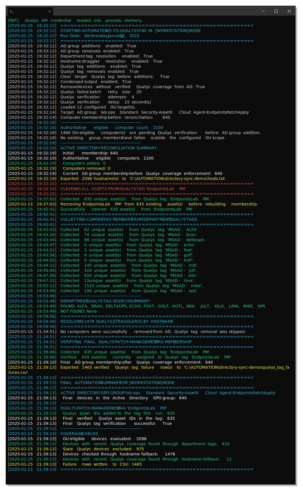
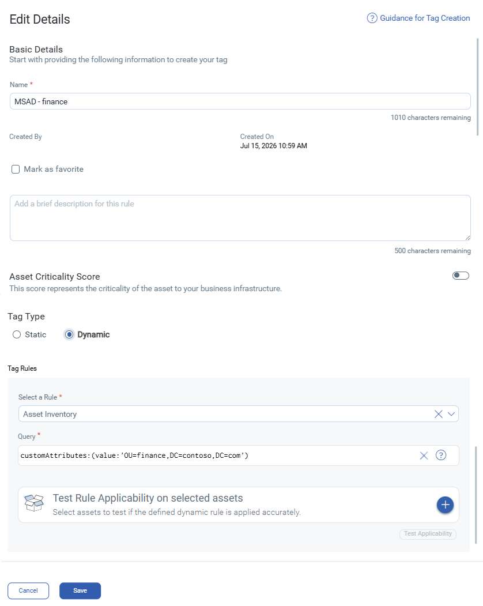

# Automated Active Directory-to-Qualys Patch Management Onboarding

> **Author:** Gabriel Wolf

Enterprise security automation for maintaining coordinated patch-management scope across Active Directory and Qualys.

The workflow discovers eligible workstation or server computers from configured Active Directory organizational units, resolves recent matching Qualys Host Asset records, applies the correct Qualys Patch Management tag, verifies final Qualys membership, and then synchronizes a dedicated Active Directory GPO group to devices with confirmed Qualys coverage.

> [!NOTE]
> This repository contains sanitized configuration values and excludes production credentials, domains, hosts, group names, directory structures, service accounts, and organization-specific identifiers.

---

## Overview

A computer can exist in Active Directory without being ready for Qualys-managed patching. It may not yet exist in Qualys, its Cloud Agent may not have checked in recently, or the required Patch Management tag may not have been applied successfully.

That distinction matters because membership in the managed Active Directory GPO group changes how the device receives updates. A device should not be placed into that group until the automation has confirmed that Qualys can manage it.

The workflow therefore uses the configured OU inventory as the authoritative candidate scope and the Active Directory GPO group as the final representation of devices with verified Qualys patch coverage.

### Simplified Workflow Diagram


The same script supports separate workstation and server profiles with independent:

- Active Directory groups
- Qualys Patch Management tags
- OU configuration files
- Operating-system filters
- Execution results

---

## Current Workflow

### 1. Load the encrypted Qualys credential

`Initialize-QualysPassword.ps1` stores the Qualys API password as a Windows DPAPI-protected `SecureString`. The initialization script must run under the same Windows account and profile that executes the automation, and the password is decrypted only when the API authentication header is created.

<details>
<summary><strong>View secure credential storage and loading</strong></summary>

> The first block prompts for the password as a `SecureString`, converts it into a DPAPI-protected encrypted string, and writes only the encrypted value to disk.
>
> ```powershell
> $QualysPassword = Read-Host `
>     -Prompt "Enter the Qualys API password" `
>     -AsSecureString
>
> $QualysPassword |
>     ConvertFrom-SecureString |
>     Set-Content -LiteralPath $SecretPath
> ```
>
> The encrypted value is stored at the configured secret path:
>
> ```text
> C:\ProgramData\QualysAutomation\qualys_password.enc
> ```
>
> The second block loads the encrypted value under the same Windows user context, restores it to a `SecureString`, and temporarily converts it to plaintext for the Qualys authentication header.
>
> ```powershell
> $QualysPassword = Get-Content `
>     -LiteralPath $SecretPath `
>     -ErrorAction Stop |
>     ConvertTo-SecureString -ErrorAction Stop
>
> $BSTR = [System.Runtime.InteropServices.Marshal]::SecureStringToBSTR(
>     $QualysPassword
> )
>
> $PlaintextQualysKey =
>     [System.Runtime.InteropServices.Marshal]::PtrToStringBSTR($BSTR)
> ```
>
> The final block explicitly clears the unmanaged BSTR from memory even when credential loading fails, reducing the time the plaintext secret remains allocated.
>
> ```powershell
> finally {
>     if ($BSTR -ne [IntPtr]::Zero) {
>         [System.Runtime.InteropServices.Marshal]::ZeroFreeBSTR($BSTR)
>     }
> }
> ```

</details>

### 2. Build the authoritative Active Directory candidate scope

The script reads the selected OU configuration file, resolves each OU beneath the configured search base, recursively enumerates computer objects, and applies the workstation or server operating-system filter.

The resulting collection is the authoritative set of devices eligible for evaluation. New candidates are not added to the Active Directory GPO group until Qualys coverage is confirmed.

<details>
<summary><strong>View recursive OU discovery and authoritative-set construction</strong></summary>

> The query uses `SearchScope Subtree` so computers in child OUs are included rather than only objects directly beneath the configured OU.
>
> ```powershell
> $OUComputers = @(
>     Get-ADComputer `
>         -Filter * `
>         -SearchBase $OU.DistinguishedName `
>         -SearchScope Subtree `
>         -Properties OperatingSystem `
>         -ErrorAction Stop
> )
>
> foreach ($Computer in $OUComputers) {
>     $IsServerOS = $Computer.OperatingSystem -match "Server"
>
>     if ($IsServerOS -eq $ActiveProfile.SkipOnMatch) {
>         continue
>     }
>
>     $DesiredMemberDNs[$Computer.DistinguishedName] = $Computer
> }
> ```
>
> The operating-system check applies the active workstation or server profile, while storing computers by distinguished name automatically deduplicates overlapping OU results.
>
> Using distinguished names as keys creates a deduplicated authoritative set even when configured scopes overlap.

</details>

### 3. Reconcile devices that left OU scope

Existing GPO-group members outside the authoritative OU set are removed when removals are enabled. Successfully removed devices can also have the corresponding Qualys Patch Management tag removed from their resolved assets.

If any configured OU cannot be resolved or queried, the script blocks all scope-based removals for that run.

<details>
<summary><strong>View scope-removal safety lock</strong></summary>

> The first block marks the authoritative inventory as incomplete whenever an OU search or enumeration fails.
>
> ```powershell
> catch {
>     $ScopeValidationPassed = $false
>     continue
> }
> ```
>
> The second block performs removals only when both the removal toggle is enabled and the complete OU scope was validated successfully.
>
> ```powershell
> if ($EnableADGroupRemovals -and $ScopeValidationPassed) {
>     $DevicesToRemove = @(
>         foreach ($Member in $InitialMembers) {
>             if (-not $DesiredMemberDNs.ContainsKey($Member.DistinguishedName)) {
>                 $Member
>             }
>         }
>     )
>
>     foreach ($Device in $DevicesToRemove) {
>         Remove-ADGroupMember `
>             -Identity $TargetGroup `
>             -Members $Device.DistinguishedName `
>             -Confirm:$false `
>             -ErrorAction Stop
>     }
> }
> ```

</details>

### 4. Exclude server-classified assets from workstation scope

In `Workstation` mode, the automation reads a configurable set of Qualys server-classification tags. Any asset found in one of those tags is excluded from both the workstation Qualys Patch Management tag and the workstation Active Directory GPO group.

<details>
<summary><strong>View cross-tag server classification</strong></summary>

> The first block builds a case-insensitive set of asset IDs collected across every configured server-classification tag. A hash set keeps membership checks fast and prevents duplicate asset IDs.
>
> ```powershell
> $ServerClassifiedAssetIds =
>     [System.Collections.Generic.HashSet[string]]::new(
>         [System.StringComparer]::OrdinalIgnoreCase
>     )
>
> foreach ($ServerClassificationTag in $QualysServerClassificationTags) {
>     $ServerTagResult = Get-QualysAssetsByTag `
>         -TagName $ServerClassificationTag `
>         -Headers $Headers `
>         -QualysPlatform $QualysPlatform
>
>     foreach ($ServerAsset in $ServerTagResult.Assets) {
>         $ServerClassifiedAssetIds.Add($ServerAsset.AssetId) | Out-Null
>     }
> }
> ```
>
> The second block enforces that classification during workstation processing by skipping any asset whose ID appears in the server set.
>
> ```powershell
> if (
>     $TargetMode -eq "Workstation" -and
>     $ServerClassifiedAssetIds.Contains($Asset.AssetId)
> ) {
>     continue
> }
> ```
>
> The public repository can replace the production tag names while preserving this classification logic.

</details>

### 5. Search department Qualys tags

For each configured department or OU, the automation searches the related `MSAD - <department>` dynamic tag, retrieves every paginated Host Asset result, normalizes hostnames, and compares them with the authoritative AD set.

Only assets with a recent `lastCheckedIn` value are eligible. Stale assets are recorded and excluded from both patch-management scopes.

<details>
<summary><strong>View paginated Qualys collection and freshness enforcement</strong></summary>

> The first block repeatedly calls the Qualys Host Asset API, tracks returned asset IDs, and follows `lastId` until Qualys reports that no additional pages remain.
>
> ```powershell
> while ($HasMoreRecords) {
>     $Response = Invoke-WebRequest `
>         -Uri $AssetSearchURL `
>         -Method Post `
>         -Headers $Headers `
>         -ContentType "text/xml" `
>         -Body $AssetPayload `
>         -ErrorAction Stop
>
>     [xml]$XmlResult = $Response.Content
>
>     foreach ($AssetNode in $XmlResult.SelectNodes("//HostAsset")) {
>         $AssetId = $AssetNode.SelectSingleNode("id").InnerText.Trim()
>         $CollectedAssetIds.Add($AssetId) | Out-Null
>     }
>
>     $HasMoreRecords = [System.Convert]::ToBoolean(
>         $XmlResult.SelectSingleNode("//hasMoreRecords").InnerText
>     )
>
>     $LastId = $XmlResult.SelectSingleNode("//lastId").InnerText
> }
> ```
>
> The second block applies the freshness requirement. Assets with no usable check-in timestamp or a timestamp older than the cutoff are recorded as stale and excluded.
>
> ```powershell
> if (
>     $null -eq $Asset.LastCheckedIn -or
>     $Asset.LastCheckedIn -lt $QualysLastSeenCutoff
> ) {
>     $DepartmentTagStaleComputerNames.Add($NormalizedDeviceName) |
>         Out-Null
>
>     continue
> }
> ```

</details>

### 6. Resolve true hostname fallback devices

Hostname fallback is limited to authoritative candidates that were not found in any department tag. Devices already identified as stale are not searched again.

Each fallback device is queried using lowercase and uppercase short-name and FQDN variants. Transient `503 Server Unavailable` responses are retried silently. When retries are exhausted, coverage is marked as unknown rather than missing.

<details>
<summary><strong>View hostname normalization and bounded 503 retry logic</strong></summary>

> The first block generates lowercase and uppercase short-name and FQDN variants so inconsistent Qualys naming does not create an immediate false negative.
>
> ```powershell
> $NameVariants = @(
>     "$($CleanName.ToLowerInvariant()).$DnsSuffix"
>     "$($CleanName.ToUpperInvariant()).$DnsSuffix"
>     $CleanName.ToLowerInvariant()
>     $CleanName.ToUpperInvariant()
> )
> ```
>
> The second block retries only `503 Server Unavailable` responses, waits according to the configured backoff schedule, and stops after a bounded number of attempts.
>
> ```powershell
> for ($Attempt = 1; $Attempt -le $MaximumAttempts; $Attempt++) {
>     try {
>         $Response = Invoke-WebRequest @RequestParameters
>         $RequestSucceeded = $true
>         break
>     }
>     catch {
>         $StatusCode = [int]$_.Exception.Response.StatusCode
>
>         if (
>             $StatusCode -eq 503 -and
>             $Attempt -le $ServiceUnavailableRetryDelaysSeconds.Count
>         ) {
>             Start-Sleep -Seconds `
>                 $ServiceUnavailableRetryDelaysSeconds[$Attempt - 1]
>
>             continue
>         }
>
>         break
>     }
> }
> ```
>
> The production implementation also preserves existing AD membership when these retries leave coverage indeterminate.

</details>

### 7. Apply Qualys Patch Management tags

Eligible Qualys asset IDs are submitted in batches of up to 200. A failed 200-asset batch is split into groups of up to 25, and only failed 25-asset groups are retried individually.

This isolates rejected assets without allowing one invalid asset to block valid assets in the same batch.

<details>
<summary><strong>View dynamic Qualys XML request construction</strong></summary>

> The first part selects the correct XML operation for either adding or removing the Qualys tag, allowing one update function to support both workflows.
>
> ```powershell
> $TagOperationXml = switch ($Action) {
>     "Add" {
> @"
> <add>
>     <TagSimple>
>         <id>$SafeTagId</id>
>     </TagSimple>
> </add>
> "@
>     }
>
>     "Remove" {
> @"
> <remove>
>     <TagSimple>
>         <id>$SafeTagId</id>
>     </TagSimple>
> </remove>
> "@
>     }
> }
> ```
>
> The second part inserts that operation into a reusable Qualys Host Asset update payload targeting the selected asset IDs.
>
> ```powershell
> $BulkUpdatePayload = @"
> <ServiceRequest>
>     <filters>
>         <Criteria field="id" operator="IN">$HostIdString</Criteria>
>     </filters>
>     <data>
>         <HostAsset>
>             <tags>$TagOperationXml</tags>
>         </HostAsset>
>     </data>
> </ServiceRequest>
> "@
> ```

</details>

<details>
<summary><strong>View failed-batch isolation</strong></summary>

> The first block immediately records every successful primary-batch asset ID. Only a failed primary batch is divided into smaller fallback groups.
>
> ```powershell
> if ($PrimaryResult.Success) {
>     foreach ($AssetId in $PrimaryBatchAssetIds) {
>         $SuccessfulAssetIds.Add($AssetId) | Out-Null
>     }
>
>     continue
> }
>
> $FallbackBatchCount = [int][Math]::Ceiling(
>     $PrimaryBatchAssetIds.Count / [double]$FallbackBatchSize
> )
> ```
>
> The second block retries only the failed fallback group one asset at a time, recording individual successes and exact failure reasons without reprocessing assets that already succeeded.
>
> ```powershell
> if (-not $FallbackResult.Success) {
>     foreach ($AssetId in $FallbackBatchAssetIds) {
>         $IndividualResult = Invoke-QualysTagBatch `
>             -BatchAssetIds @($AssetId) `
>             -BatchLabel "$FallbackLabel individual asset $AssetId"
>
>         if ($IndividualResult.Success) {
>             $SuccessfulAssetIds.Add($AssetId) | Out-Null
>         }
>         else {
>             $FailedAssetIds.Add($AssetId) | Out-Null
>             $FailureReasons[$AssetId] = $IndividualResult.Reason
>         }
>     }
> }
> ```

</details>

### 8. Verify final Qualys membership

After updates complete, the script re-queries the target Patch Management tag and compares actual membership with the asset IDs expected to receive coverage.

An accepted API response is not considered final proof. Coverage-based Active Directory changes occur only after the expected Qualys state is confirmed.

<details>
<summary><strong>View final-state verification gate</strong></summary>

> The first block compares the expected asset set with a fresh read of the target tag and identifies anything that is still missing.
>
> ```powershell
> $MissingExpectedAssetIds = @(
>     $CurrentTargetAssetIds |
>         Where-Object {
>             -not $VerifiedTargetAssetIds.Contains($_)
>         }
> )
>
> if ($MissingExpectedAssetIds.Count -eq 0) {
>     $VerificationSucceeded = $true
> }
> ```
>
> The second block is the safety gate: when final state cannot be confirmed, the script prevents all coverage-based Active Directory changes for that run.
>
> ```powershell
> if (-not $VerificationSucceeded) {
>     Log-Message `
>         "SAFETY LOCK: Final Qualys verification failed. No coverage-based AD group changes were made." `
>         "Red"
> }
> ```

</details>

### 9. Synchronize the Active Directory GPO group

After successful Qualys verification, the script adds OU-eligible devices with at least one recent, verified Qualys asset in the target tag.

Existing members that no longer have verified recent coverage can be removed. Stale, unresolved, and server-classified workstation candidates remain outside the group, while existing members with indeterminate coverage caused by API failures are preserved.

<details>
<summary><strong>View verified-coverage AD synchronization</strong></summary>

> The first block evaluates every Qualys asset ID associated with a computer and marks the computer as covered when at least one ID appears in the verified target tag.
>
> ```powershell
> foreach ($AssetId in $ResolvedAssetIds) {
>     if ($VerifiedTargetAssetIds.Contains($AssetId)) {
>         $HasVerifiedCoverage = $true
>         break
>     }
> }
>
> if ($HasVerifiedCoverage) {
>     $VerifiedCoveredComputerNames.Add($ComputerName) | Out-Null
> }
> ```
>
> The second block performs the actual group addition only after that verified-coverage decision has been made.
>
> ```powershell
> Add-ADGroupMember `
>     -Identity $TargetGroup `
>     -Members $DesiredComputerByName[$ComputerName].DistinguishedName `
>     -ErrorAction Stop
> ```
>
> The third block protects existing members when API failures leave coverage indeterminate. Instead of treating unknown coverage as missing coverage, it records the reason and makes no AD change.
>
> ```powershell
> if ($CoverageUnknownComputerNames.Contains($Member.Name)) {
>     $QualysCoverageADActionMap[$Member.Name] =
>         "No AD group change was made because Qualys coverage could not be determined after API retries."
>
>     continue
> }
> ```

</details>

## Successful Execution Example

> [!NOTE]
> This is a real production output. All example outputs have been sanitized. Output depends on the selected mode, configuration toggles, asset inventory, and current Qualys state.



---

## Project Files

### [`Automation.ps1`](Automation.ps1)

The main automation script. 

The script handles OU discovery, operating-system filtering, server-tag exclusions, Qualys asset resolution, freshness checks, batched tag updates, final verification, Active Directory synchronization, logging, and failure reporting.

### [`Initialize-QualysPassword.ps1`](Initialize-QualysPassword.ps1)

Creates the encrypted Qualys API credential used by the automation and diagnostic scripts.

The script must be run under the same Windows execution identity and profile that will run the scheduled automation unless the credential is regenerated for a different context.

The encrypted credential file and its containing directory should be protected with appropriate filesystem permissions.

### [`Get-QualysAsset.ps1`](Get-QualysAsset.ps1)

A diagnostic utility for validating Qualys API connectivity and testing an individual hostname search.

It:

- Loads the encrypted Qualys credential
- Searches for an exact Host Asset name
- Displays the returned Host Asset ID
- Displays the asset name
- Displays additional returned asset details when available


### [`Schedule-Task.ps1`](Schedule-Task.ps1)

Registers workstation and server automation runs in Windows Task Scheduler.

To run a scheduled task, the execution account requires the ```Log on as a batch job``` user right and must not be restricted by ```Deny log on as a batch job```.

The account must:

- Be able to decrypt the encrypted Qualys credential
- Have the required Active Directory permissions
- Have the required Qualys API permissions
- Be allowed to run as a batch job
- Have network access to Active Directory and Qualys

Regenerate the encrypted credential whenever the execution account, Windows profile, host, or Qualys credential changes.


---

## Required Configuration Files


<details>
  <summary>View Required Configuration Files</summary>

The OU configuration files must be stored in the same directory as `Automation.ps1`.

### `<list-of-workstation-ous.txt>`

Contains the department or top-level OU names evaluated in workstation mode.

```text
IT
FINANCE
HR
```

### `<list-of-server-ous.txt>`

Contains the department or top-level OU names evaluated in server mode.

```text
APPLICATIONS
INFRASTRUCTURE
DATABASES
```

Each non-empty line represents one OU name. Blank lines are ignored.

Each configured value must align with:

- An OU beneath the configured Active Directory search base
- A related Qualys dynamic tag following the `MSAD - <department>` convention

</details>

---

## Generated Files

<details>
  <summary>View Generated Files</summary>
     
### `hosts.txt`

Contains the final computer names in the Active Directory GPO group after verified Qualys coverage enforcement.

The file is overwritten during each run.

### `sync_log.txt`

Contains timestamped execution details, warnings, errors, and final summaries. The file is appended to preserve history, while condensed console mode suppresses repetitive per-device and per-batch messages.

### `qualys_tag_failures.csv`

Contains unresolved, stale, unverified, API-error, tag-update, and Active Directory action failures. Fully verified devices are excluded, and the file is overwritten during each run.

### `<secret-directory>/<secret-file-name.enc>`

Contains the encrypted Qualys credential created by `Initialize-QualysPassword.ps1`.

This file must not be committed to source control.

</details>

---

## Requirements

<details>
  <summary>View Requirements</summary>
     
### PowerShell and Windows

- Windows PowerShell 5.1 or a compatible PowerShell environment
- Windows host joined to or able to query the target Active Directory domain
- Active Directory PowerShell module
- TLS 1.2 connectivity to the Qualys API

Verify the Active Directory module:

```powershell
Get-Module -ListAvailable ActiveDirectory
```

### Active Directory permissions

The execution account requires permission to:

- Read configured organizational units
- Read computer objects and operating-system attributes
- Read the managed Active Directory groups
- Enumerate group membership
- Add computer objects to the managed groups
- Remove computer objects from the managed groups

Delegate only the permissions required for the configured OUs and groups.

### Qualys permissions

The Qualys API account requires permission to:

- Search Host Asset records
- Search and read tags
- Read paginated Host Assets assigned to tags
- Add Host Asset tag assignments
- Remove Host Asset tag assignments

Use a least-privileged Qualys role that supports these operations.

### Network access

The execution host must be able to reach:

- Active Directory domain controllers
- Required DNS services
- The configured Qualys API platform over HTTPS

</details>

---


## Initial Setup

### 1. Configure the environment

Update the sanitized configuration variables in `Automation.ps1`:

```powershell
$QualysUsername = "<your-api-username>"
$QualysPlatform = "<qualys-api-platform>"
$SecretPath     = "<path-to-encrypted-secret>"

$DnsSuffix        = "<example.com>"
$OUMenuSearchBase = "<DC=example,DC=com>"

$WorkstationADGroupDN = "<workstation-gpo-group-distinguished-name>"
$ServerADGroupDN      = "<server-gpo-group-distinguished-name>"

$WorkstationQualysTag = "<workstation-patch-management-tag>"
$ServerQualysTag      = "<server-patch-management-tag>"

$QualysServerClassificationTags = @(
    "<server-classification-tag-1>"
    "<server-classification-tag-2>"
)

$WorkstationOUFileName = "<list-of-workstation-ous.txt>"
$ServerOUFileName      = "<list-of-server-ous.txt>"

$QualysLastSeenDays = 30
```

Operational toggles include:

```powershell
$ClearTargetQualysTagBeforeAdd
$EnableADGroupAdditions
$EnableADGroupRemovals
$EnableDepartmentTagResolution
$EnableStragglerResolution
$EnableQualysTagAdditions
$EnableQualysTagRemovals
$CondensedOutput
$RemoveUnverifiedDevicesFromAD
```

Retry and verification settings include:

```powershell
$QualysFallbackBatchSize
$QualysVerificationAttempts
$QualysVerificationDelaySeconds
$Qualys503RetryDelaysSeconds
```

### 2. Create the OU configuration files

Create workstation and server OU lists using names that align with both Active Directory and the related Qualys department tags. Blank lines are ignored and duplicates are removed.

### 3. Create the Qualys department dynamic tags

The `MSAD - <department>` naming convention is specific to this workflow and is not created automatically by Qualys.

Create one dynamic tag for each configured department.

```text
Tag name: MSAD - <department>
Tag type: Dynamic
Dynamic tag source: Asset Inventory
Query: customAttributes:(value:'OU=<DEPARTMENT>,DC=<EXAMPLE>,DC=<COM>')
```

Example:

<details>
  <summary> View Example MSAD Tag</summary>
  
</details>

The script checks both uppercase and lowercase department-name variants. Only one consistent variant needs to exist.

### 4. Initialize the Qualys credential

Run the initialization script under the same account that will execute the automation:

```powershell
.\Initialize-QualysPassword.ps1
```

Confirm that the encrypted credential file was created at the configured secret path.

### 5. Test an individual Qualys asset

Set a sanitized test hostname inside `Get-QualysAsset.ps1` and run:

```powershell
.\Get-QualysAsset.ps1
```

Confirm that the expected Host Asset record is returned.

### 6. Run Automation script

Run workstation mode:

```powershell
.\Automation.ps1 -TargetMode Workstation
```

Run server mode: 

```powershell
.\Automation.ps1 -TargetMode Server
```


---

## Design and Safety

### Authoritative scope and verified coverage

Configured OUs define the candidate inventory. The Active Directory GPO group contains only devices with recent, verified Qualys coverage.

### Resolution safeguards

Department tags are checked first. Stale devices are not searched again, hostname fallback is limited to true misses, and server-classified assets are excluded from workstation scope.

### Failure safeguards

Temporary 503 responses are retried. Existing AD members are left unchanged when coverage remains unknown, failed Qualys batches are narrowed to isolate rejected assets, and final verification must succeed before coverage-based AD changes occur.

### Removal safeguards

If any configured OU cannot be resolved or queried, scope-based removals are blocked. Asset IDs still present in the current target set are also protected from Qualys tag removal.

### Deduplication

Qualys asset IDs are deduplicated before updates. A single AD computer may map to multiple Qualys asset IDs, so AD and Qualys totals may differ.

---

## Security Considerations

- Do not hardcode or commit credentials.
- Run the workflow under a dedicated execution account with least-privileged Active Directory and Qualys permissions.
- Restrict access to scripts, encrypted credentials, logs, reports, and scheduled-task configuration.
- Regenerate the encrypted credential after changing the execution identity, host, profile, or Qualys password.
- Treat the managed AD groups, logs, hostnames, and Qualys asset IDs as internal operational data.
- Keep public configuration values sanitized and validate removal behavior before production use.

---

## Error Handling

The automation stops, skips processing, or activates a safety lock for missing credentials or configuration, Active Directory query or membership failures, Qualys API and pagination errors, stale or missing assets, failed tag updates, and failed final verification.

Errors and warnings are written to both the console, `sync_log.txt`, and `qualys_tag_failures.csv`.

---

## Disclaimer

This repository demonstrates an enterprise security automation pattern.

Names, credentials, paths, domains, organizational units, departments, groups, tags, service accounts, and other environment-specific values shown in the public version are placeholders or sanitized examples.

Review and test all scripts, permissions, dynamic-tag queries, update-policy behavior, and removal controls before using the workflow in another environment.
