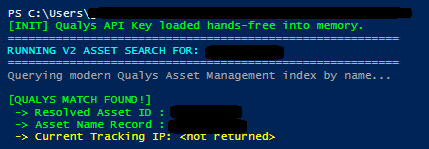
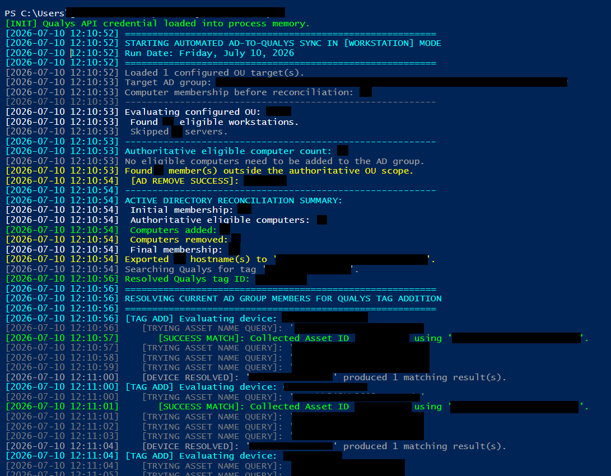
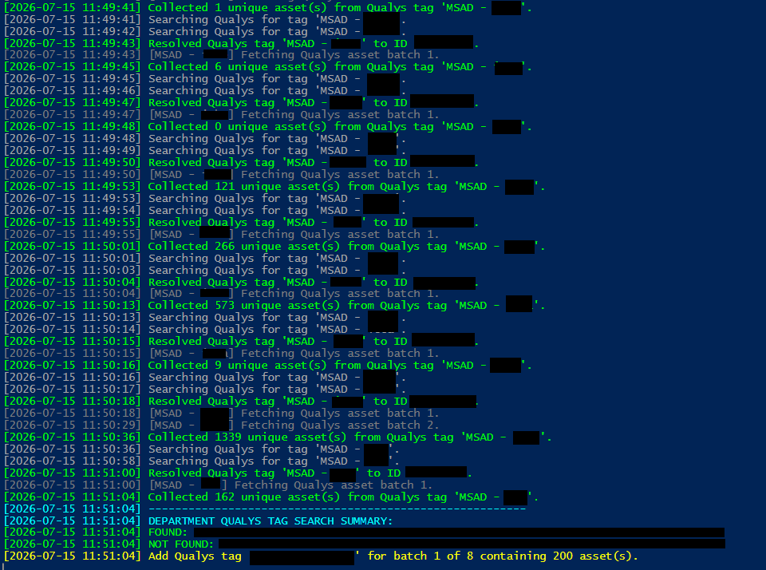
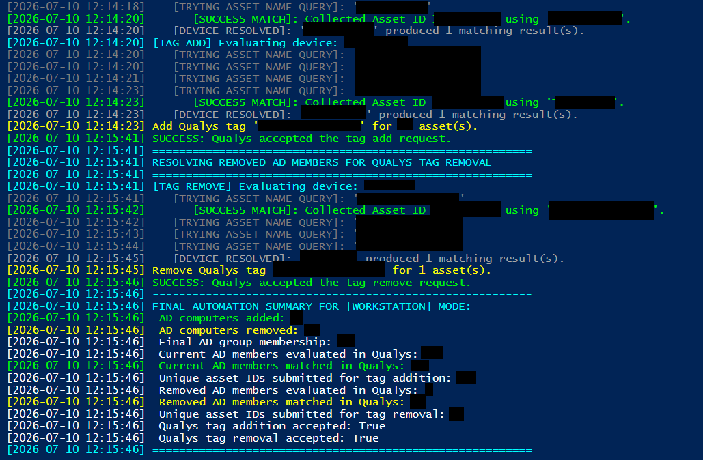

# Automated AD-to-Qualys Patch Management Onboarding
> **Author:** Gabriel Wolf

Enterprise security automation for synchronizing Active Directory computer inventories with Qualys Patch Management.

This project discovers eligible workstation and server assets from designated Active Directory organizational units, synchronizes those systems with the appropriate security groups, and uses department-based Qualys dynamic tags to resolve assets efficiently. Assets not matched through a department tag are resolved individually by hostname, after which the appropriate Qualys patch-management tag is applied in batches. Systems that leave the configured OU scope are removed from both the Active Directory group and the corresponding Qualys patch-management scope.

> [!NOTE]
> This automation was developed for and is actively used in a large-scale enterprise environment. The public repository contains sanitized configuration values and does not include production credentials, internal infrastructure details, or organization-specific identifiers.

---

## Overview

Enterprise patch-management platforms depend on accurate asset scope.

A computer may exist in Active Directory and have the Qualys Cloud Agent installed, but it will not necessarily receive the intended patch jobs unless it is assigned to the correct Qualys tag or asset group.

This automation connects the two systems:


The result is a repeatable onboarding process that reduces manual asset handling and helps ensure newly deployed systems are brought under enterprise patch-management controls.

---

## Patch-Management Workflow

The automation performs the following operations:

1. Runs in either `Workstation` or `Server` mode.
2. Reads a list of Active Directory organizational units from the corresponding configuration file.
3. Searches those OUs recursively for computer objects.
4. Uses the computer operating-system value to separate workstations from servers.
5. Builds an authoritative list of computers that should be included in the selected patch-management scope.
6. Compares that authoritative list against the appropriate Active Directory security group.
7. Adds eligible computers that are missing from the group.
8. Removes existing group members that are no longer located within the configured OU scope.
9. Prevents removals when one or more configured OUs cannot be successfully resolved or queried.
10. Compiles the reconciled group membership into a list of hostnames.
11. Resolves the configured Qualys patch-management tag by name.
12. Builds department tag names from the configured OU list and searches Qualys for both uppercase and lowercase variants.
    * `MSAD - DEPARTMENT`
    * `MSAD - department`
13. Retrieves all assets assigned to each matching department tag, including paginated results.
14. Normalizes the returned Qualys asset names and compares them against the final Active Directory group membership.
15. Collects and deduplicates asset IDs only for devices that remain in the authoritative AD scope.
16. Identifies stragglers as final AD group members that were not matched through a department Qualys tag.
17. Resolves only those stragglers through the Qualys Asset Management API by testing four hostname formats:
    * Lowercase fully qualified domain name
    * Uppercase fully qualified domain name
    * Lowercase short hostname
    * Uppercase short hostname
18. Combines and deduplicates asset IDs returned through department-tag collection and hostname-based straggler resolution.
19. Applies the patch-management tag to current assets in smaller bulk batches to avoid oversized Qualys update requests.
20. Tracks computers successfully removed from the Active Directory group and resolves their Qualys asset IDs by hostname.
21. Prevents tag removal from any asset that is also present in the current authoritative target set.
22. Removes the patch-management tag in bulk from assets associated with computers successfully removed from the AD group.
23. Reports which department tags were found and which were not found after both capitalization variants are tested.
24. Writes execution details, reconciliation results, API activity, batch status, and summary statistics to a local log.

This creates a two-way onboarding and offboarding workflow. Newly eligible systems are added to the appropriate Active Directory group, matched through their department Qualys tags whenever possible, and assigned the corresponding patch-management tag. Devices that cannot be matched through department tags are resolved individually as stragglers.

Systems that leave the configured OU scope are removed from the Active Directory group and have their Qualys patch-management tag removed, while safety checks prevent currently eligible assets from being unintentionally untagged.

Qualys patch jobs can target the workstation or server patch-management tag, allowing asset membership to remain aligned with the organization’s Active Directory structure without requiring an engineer to manually locate, tag, or untag each device.

---

## Project Files
### [`Automation.ps1`](Automation.ps1)

The main production automation script.

It supports two execution modes:

```powershell
.\Automation.ps1 -TargetMode Workstation
```

```powershell
.\Automation.ps1 -TargetMode Server
```

The script:

* Loads the encrypted Qualys credential
* Reads the appropriate OU configuration file
* Discovers computers recursively within the configured Active Directory OUs
* Filters computers by operating-system type
* Builds an authoritative workstation or server membership set
* Adds missing computers to the appropriate Active Directory group
* Removes computers that are no longer within the configured OU scope
* Enables a removal safety lock if an OU cannot be resolved or queried
* Exports the reconciled group membership to `hosts.txt`
* Resolves the configured workstation or server Qualys patch-management tag by name
* Builds department tag names from the configured OU list
* Searches for both `MSAD - DEPARTMENT` and `MSAD - department`
* Retrieves all paginated assets associated with each matching department tag
* Normalizes returned Qualys asset names and matches them against the final Active Directory group membership
* Reports which department tags were found and which were not found
* Identifies final AD group members that were not matched through a department tag as stragglers
* Tests four hostname formats only for stragglers and computers removed from Active Directory
* Deduplicates asset IDs returned through department-tag and hostname-based resolution
* Applies the patch-management tag to current assets in smaller batches
* Removes the patch-management tag from computers successfully removed from Active Directory
* Prevents an asset from being untagged if it is still part of the current authoritative target set
* Records Active Directory changes, department-tag searches, pagination activity, Qualys API activity, batch results, errors, and execution statistics in `sync_log.txt`

---

### [`Get-QualysAsset.ps1`](Get-QualysAsset.ps1)

A diagnostic and validation utility used to search for an individual asset in Qualys by hostname.

The script:

* Loads the encrypted Qualys credential
* Submits an XML asset search request to the Qualys Asset Management API
* Searches for an exact asset-name match
* Extracts the returned asset ID
* Displays the asset name
* Displays the current tracking IP when available

This utility is useful when validating API connectivity, troubleshooting hostname mismatches, or confirming that a device is present in the Qualys asset inventory before running the full automation.

---

### [`Initialize-QualysPassword.ps1`](Initialize-QualysPassword.ps1)

Initializes the encrypted Qualys API credential used by the other scripts.

The script prompts for the Qualys password or API credential as a PowerShell `SecureString` and stores an encrypted representation at:

```text
C:\ProgramData\QualysAutomation\qualys_password.enc
```

When `ConvertFrom-SecureString` is used without a custom encryption key on Windows, PowerShell uses Windows Data Protection API protection associated with the current Windows user context.

The initialization script must therefore be run under the same Windows account that will execute the scheduled automation.

This approach prevents the Qualys credential from being:

* Hardcoded in the PowerShell scripts
* Stored in a plaintext configuration file
* Committed to source control
* Exposed through ordinary repository access

The credential is decrypted into process memory when required for API authentication. It should therefore be protected through appropriate service-account security, host hardening, filesystem permissions, and least-privilege access.

---

### [`Schedule-Task.ps1`](Schedule-Task.ps1)

A deployment utility used to register the automation workflow as a persistent background task within the Windows Task Scheduler.

The script:

* Extracts environment-specific parameters (such as the script path, execution times, and target modes) into a configurable variable block
* Constructs a scheduled task action to execute PowerShell with an explicit execution-policy bypass
* Creates a daily trigger based on a specified execution runtime
* Applies high-availability background settings, allowing the task to run on battery power and requiring an active network connection before initiation
* Prompts the executing administrator for the target service account's password using a secure credential dialog
* Registers the scheduled task globally on the host operating system with elevated administrative privileges (`-RunLevel Highest`)
* Configures the task to run invisibly in the background regardless of whether the target service account is currently signed into an active desktop session

This utility simplifies the deployment process across different environments while completely keeping system paths, custom domain structures, and execution schedules abstracted out of the core functional code.

---

## Required Configuration Files

The automation expects additional text files in the same directory as `Automation.ps1`.

### `<list-of-workstation-ous.txt>`

Contains the names of Active Directory organizational units that should be evaluated when the script runs in workstation mode.

Example:

```text
Finance Workstations
Engineering Workstations
Administrative Workstations
```

Each non-empty line represents one OU name.

The script searches for these OUs beneath the configured Active Directory search base and recursively evaluates the computer objects inside them.

---

### `<list-of-server-ous.txt>`

Contains the names of Active Directory organizational units that should be evaluated when the script runs in server mode.

Example:

```text
Application Servers
Infrastructure Servers
Database Servers
```

Each non-empty line represents one OU name.

---

## Generated Files

The following files are created or updated automatically during execution.

### `hosts.txt`

Contains the final list of computer names compiled from the selected Active Directory group.

This file provides a simple record of the hostnames included in the Qualys resolution phase.

It is overwritten during each run.

---

### `sync_log.txt`

Contains timestamped operational logs, including:

* Selected execution mode
* Active Directory group membership counts
* OU discovery results
* Computers added to the AD group
* Active Directory errors
* Qualys hostname search attempts
* Successful Qualys asset matches
* Unmatched devices
* Bulk tag-assignment results
* Final execution statistics

This file is appended to rather than overwritten, providing a historical execution trail.

---

### `<secret-directory>/<secret-file-name.enc>`

Generated by `Initialize-QualysPassword.ps1`.

This file must not be committed to the repository.

Add it to `.gitignore` if the credential path is ever changed to a location inside the project directory.

---

## Repository Structure

```text
.
├── Automation.ps1
├── Get-QualysAsset.ps1
├── Initialize-QualysPassword.ps1
├── <list-of-workstation-ous.txt>
├── <list-of-server-ous.txt>
├── README.md
└── imgs
```

The following files may appear after execution:

```text
hosts.txt
sync_log.txt
```

---

## Successful Execution Examples

### Qualys Asset Lookup

The following example shows `Get-QualysAsset.ps1` successfully resolving a hostname to a Qualys asset record.



### Automated AD-to-Qualys Synchronization

The following example shows `Automation.ps1` successfully processing Active Directory targets, resolving Qualys assets, and applying the configured patch-management tag.





---
## Requirements

### PowerShell and Windows

* Windows PowerShell 5.1 or a compatible PowerShell environment
* Windows host joined to or able to query the target Active Directory domain
* Active Directory PowerShell module
* TLS 1.2 connectivity to the Qualys API

The Active Directory module can be verified with:

```powershell
Get-Module -ListAvailable ActiveDirectory
```

---

### Active Directory Permissions

The execution account requires permission to:

* Read the configured organizational units
* Read computer objects and operating-system attributes
* Read the target Active Directory groups
* Enumerate group membership
* Add computer objects to the target groups
* Remove computer objects from the target groups

The account does not need unrestricted domain-administrator access.

Only the permissions required for the designated OUs and groups should be delegated.

---

### Qualys Permissions

The Qualys account requires sufficient API permissions to:

* Search Asset Management records
* Search and read tags
* Read all paginated assets associated with a tag
* Update host-asset tag assignments

The exact Qualys role and API permissions should be limited to the functions required by this automation.

---

### Network Access

The execution host must be able to reach:

* Active Directory domain controllers
* DNS services required for the environment
* The configured Qualys API platform over HTTPS

---

## Initial Setup

### 1. Configure the environment variables

Update the configuration values in `Automation.ps1`:

```powershell
$QualysUsername = "<your-api-username>"
$QualysPlatform = "<qualysapi.qualys.com>"
$SecretPath     = "<path-to-secret-enc>"

$DnsSuffix       = "<foo.bar>"
$OUMenuSearchBase = "<DC=foo,DC=bar>"

$WorkstationADGroupDN = "<CN=workstations-group-name,OU=xyz,OU=abc,DC=foo,DC=bar>"
$ServerADGroupDN      = "<CN=servers-group-name,OU=xyz,OU=abc,DC=foo,DC=bar>"

$WorkstationQualysTag = "<qualys-workstations-tag-group>"
$ServerQualysTag      = "<qualys-servers-tag-group>"

$WorkstationOUFileName = "<list-of-workstation-ous.txt>"
$ServerOUFileName      = "<list-of-server-ous.txt>"
```

The values in this public repository should remain sanitized and should not identify production domains, service accounts, computer names, or internal directory structures.

---

### 2. Create the OU configuration files

Populate `<list-of-workstation-ous.txt>` and `<list-of-server-ous.txt>` with the OU names that should be evaluated.

Use the department or top-level OU name expected by both Active Directory and the corresponding Qualys dynamic tag.

Example:

```text
IT
FINANCE
HR
```

Blank lines are ignored.

---

### 3. Create the Qualys department dynamic tags

The `MSAD - <department>` naming convention is specific to this automation and is not created automatically by Qualys.

Create one dynamic Qualys tag for every department listed in the workstation or server OU configuration files.

Use the following configuration for each tag:

```text
Tag name: MSAD - <department>
Tag type: Dynamic
Dynamic tag source: Asset Inventory
Query: customAttributes:(value:'OU=<DEPARTMENT>,DC=<CONTOSO>,DC=<COM>')
```

Replace the placeholders with the department OU and domain components used in the target environment.

Example:

```text
Tag name: MSAD - finance
Query: customAttributes:(value:'OU=FINANCE,DC=CONTOSO,DC=COM')
```

The automation checks both capitalization forms for each configured department:

```text
MSAD - DEPARTMENT
MSAD - department
```

Only one form needs to exist. To avoid duplicate administration, use one consistent naming convention across all department tags.

These department tags are used as the primary Qualys asset-discovery method. Assets returned by a department tag are accepted only when their normalized hostname also exists in the final authoritative Active Directory group.

---

### 4. Initialize the Qualys credential

Run the initialization script under the same account that will execute the automation:

```powershell
.\Initialize-QualysPassword.ps1
```

Enter the Qualys API credential when prompted.

Confirm that the encrypted file was created at the configured secret path.

---

### 5. Test a single Qualys asset

Set the test hostname inside `Get-QualysAsset.ps1`, and then run:

```powershell
.\Get-QualysAsset.ps1
```

Confirm that the expected asset ID and hostname are returned.

---

### 6. Test workstation mode

```powershell
.\Automation.ps1 -TargetMode Workstation
```

Review:

```text
sync_log.txt
hosts.txt
```

Confirm that the correct Active Directory group and Qualys tag were selected.

---

### 7. Test server mode

```powershell
.\Automation.ps1 -TargetMode Server
```

Again, confirm that the correct group, tag, and OU configuration file were selected.

---

## Scheduled Execution

The script can be run through Windows Task Scheduler under a dedicated service account.

Use the [`Schedule-Task.ps1`](Schedule-Task.ps1) script.

The scheduled-task account must be the same account that ran `Initialize-QualysPassword.ps1`, unless the encrypted credential is regenerated under the new execution identity.

---

## Design Considerations

### Separate Workstation and Server Profiles

A single script supports both asset classes while retaining separate:

* Active Directory groups
* Qualys tags
* OU configuration files
* Operating-system selection behavior
* Reconciliation results
* Execution logs and statistics

This reduces duplicated code while preserving distinct workstation and server patch-management scopes.

---

### Configured OUs as the Authoritative Source

The configured OU list defines which systems should belong to each patch-management scope.

During each run, the script recursively discovers eligible computers within those OUs, filters them by operating-system type, and builds an authoritative membership set.

That set is then compared against the corresponding Active Directory group:

* Eligible computers missing from the group are added.
* Existing group members no longer present in the configured OU scope are removed.
* Devices successfully removed from the AD group are also processed for Qualys tag removal.

This makes the Active Directory group a synchronized and auditable representation of the systems currently intended for patch management.

---

### Removal Safety Lock

Removing systems from patch-management scope is more sensitive than adding them.

To reduce the risk of accidental mass removal, the script disables all removal operations if any configured OU cannot be successfully resolved or queried.

Possible causes include:

* An incorrect OU name
* An unavailable domain controller
* Insufficient Active Directory permissions
* A transient directory-service failure

When the safety lock is enabled, the script may continue processing valid additions, but it does not remove computers from the Active Directory group or remove their Qualys tags.

---

### Department-First Asset Resolution and Hostname Normalization

The automation first resolves assets through the Qualys department dynamic tags associated with the configured OU names.

For every configured department, it:

1. Checks both `MSAD - DEPARTMENT` and `MSAD - department`.
2. Retrieves all assets assigned to the matching dynamic tag, including paginated results.
3. Normalizes each returned asset name to a short hostname.
4. Accepts the asset only when that hostname exists in the final authoritative Active Directory group.
5. Deduplicates the accepted Qualys asset IDs.

A straggler is a final Active Directory group member that was not matched through any department tag.

Only those stragglers are resolved through four separate hostname queries:

```text
hostname.example.com
HOSTNAME.example.com
hostname
HOSTNAME
```

The four variants are intentionally preserved because Qualys asset records may use different naming formats and capitalization.

Asset IDs returned through department-tag collection and hostname-based straggler resolution are deduplicated before tag changes are submitted.

---

### Two-Way Qualys Tag Reconciliation

The automation manages both entry into and removal from the Qualys patch-management scope.

For current Active Directory group members, the script:

1. Resolves the workstation or server patch-management tag.
2. Searches the corresponding department dynamic tags.
3. Retrieves all paginated assets associated with those tags.
4. Matches normalized Qualys hostnames against the final Active Directory group membership.
5. Identifies unmatched AD members as stragglers.
6. Resolves only those stragglers using the four hostname variants.
7. Combines and deduplicates all accepted asset IDs.
8. Applies the configured patch-management tag in batches.

For computers successfully removed from the Active Directory group, the script:

1. Resolves their Qualys asset IDs using the four hostname variants.
2. Deduplicates the returned IDs.
3. Excludes any asset ID that is still part of the current authoritative target set.
4. Removes the configured patch-management tag in batches.

The script removes the Qualys tag only from computers successfully removed from the managed Active Directory group during the current run. It does not independently purge every preexisting asset from the Qualys patch-management tag.

---

### Batched Qualys Tag Updates

Rather than sending a separate tag update for every asset or one oversized request for the entire inventory, the script compiles unique Qualys asset IDs and submits them in smaller batches.

Batched requests are used for:

* Adding the patch-management tag to assets matched through department tags
* Adding the patch-management tag to hostname-resolved stragglers
* Removing the patch-management tag from former assets

Each batch is logged independently so failed requests can be identified without losing visibility into successful batches.

This reduces API traffic while avoiding request-size failures in large enterprise inventories.

---

## Logging and Operational Visibility

The automation records detailed information to support routine operational review, troubleshooting, and auditability.

Examples include:

```text
[AD ADD SUCCESS]
[AD ADD FAILED]
[AD REMOVE SUCCESS]
[AD REMOVE FAILED]
[TRYING ASSET NAME QUERY]
[SUCCESS MATCH]
[DUPLICATE MATCH]
[QUALYS ASSET NOT FOUND]
[API EXCEPTION]
DEPARTMENT QUALYS TAG SEARCH SUMMARY
FOUND:
NOT FOUND:
SAFETY LOCK
CRITICAL ERROR
ACTIVE DIRECTORY RECONCILIATION SUMMARY
FINAL AUTOMATION SUMMARY
```

The log includes:

* Initial and final Active Directory group membership
* Authoritative OU-scope totals
* Computers added to the AD group
* Computers removed from the AD group
* Active Directory operation failures
* Department-tag searches and pagination activity
* Departments whose dynamic tags were found or not found
* Assets evaluated and matched through department tags
* Hostname stragglers requiring individual resolution
* Qualys hostname queries for stragglers and removed members
* Matched and unmatched assets
* Unique asset IDs collected
* Per-batch Qualys tag-addition results
* Per-batch Qualys tag-removal results
* Safety-lock activation

Because logs may contain internal hostnames, directory names, tag names, asset IDs, or error details, production log files should not be committed to a public repository.

---

## Security Considerations

* Do not hardcode credentials in the scripts.
* Do not commit `qualys_password.enc`.
* Run the automation through a dedicated service account.
* Delegate only the required Active Directory permissions.
* Ensure the service account has permission to both add and remove members from the managed AD groups.
* Limit the Qualys API account to the required asset-search, tag-read, and tag-update operations.
* Restrict filesystem access to the script and credential directories.
* Protect scheduled-task definitions and service-account credentials.
* Treat generated logs and hostname exports as internal operational data.
* Rotate the Qualys credential according to organizational policy.
* Regenerate the encrypted secret after changing the execution account, host, Windows profile, or Qualys credential.
* Treat the configured AD groups as automation-managed groups.
* Avoid manually adding devices to those groups unless they also belong to the configured OU scope.
* Review OU configuration changes carefully because they directly affect AD group membership, department-tag discovery, and Qualys patch scope.
* Keep the OU configuration names aligned with the corresponding `MSAD - <department>` dynamic tags.
* Validate each dynamic tag query before enabling scheduled production execution.
* Test removal behavior in a controlled environment before enabling scheduled production execution.

---

## Recommended `.gitignore`

```gitignore
# Generated operational data
hosts.txt
sync_log.txt
*.log

# Credentials and encrypted secret material
*.enc
qualys_password.enc

# Local test files
*.local.ps1
test-output/
```

---

## Error Handling

The automation stops, skips processing, or enables a safety lock when it encounters conditions such as:

* Missing encrypted credential
* Credential decryption failure
* Missing OU configuration file
* Empty OU configuration file
* Missing Active Directory group
* Failed AD group membership enumeration
* Unresolvable OU name
* Multiple OUs matching the same configured name
* Failed OU computer enumeration
* Failed Active Directory group addition
* Failed Active Directory group removal
* Qualys API communication failure
* Missing target Qualys patch-management tag
* Neither capitalization variant of a department Qualys tag being found
* Failed department-tag asset pagination
* Missing pagination metadata when Qualys reports additional records
* Unmatched hostname
* Failed Qualys tag-addition batch
* Failed Qualys tag-removal batch
* An asset scheduled for removal also appearing in the current authoritative target set

If any configured OU cannot be fully validated, the script enables the removal safety lock and prevents both AD group removal and Qualys tag removal for that run.

Errors and warnings are written to both the console and `sync_log.txt`.

---

### Useful Links

* [Qualys PM API Docs](https://gateway.qg1.apps.qualys.com/apidocs/pm/v1#/Patch%20Report%20Resource/submitAssetsTabReportUsingGET) – Direct link to the Qualys Patch Management (v1) reference for submitting Asset Tab reports.

---

## Disclaimer

This repository is intended to demonstrate an enterprise security automation pattern.
Names, credentials, paths, domains, organizational units, groups, tags, and other environment-specific values shown in the public version are placeholders or sanitized examples. The scripts should be reviewed, tested, and adapted to the security requirements of the target environment before use.
